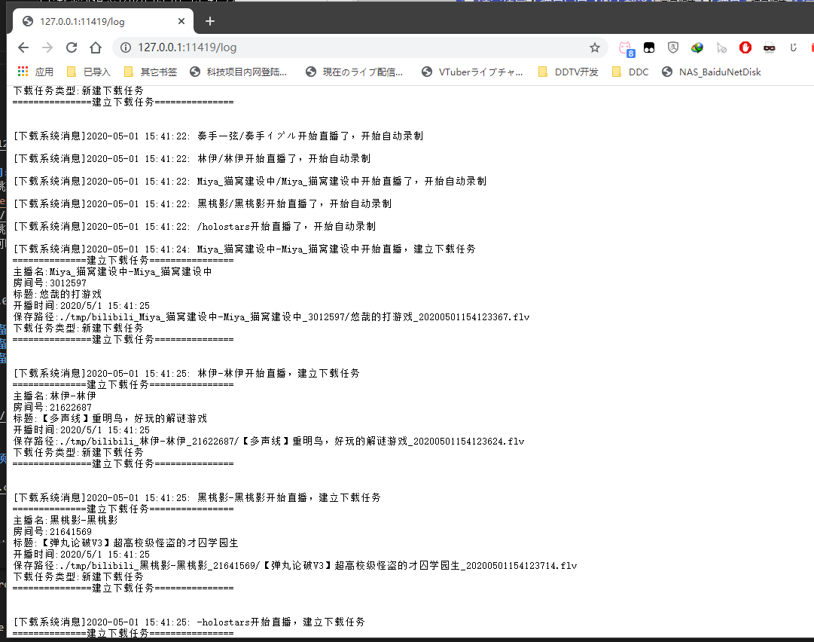

# DDTVLiveRec

一个低消耗的windows/linux/MacOS全平台通用的B站直播录制工具

***
(代码中大量 **中文** 变量\函数 **易#** 警告，美术生出身，请各位大佬轻拍 
***

# 功能完成情况
* 支持linux，可以挂在路由器或树莓派等linux嵌入式设备上运行
* 开播自动录制
* 录制完成后自动合并文件
* 多路异步下载
* 在网页直接查看运行状态\日志\下载文件列表
* 直接启动后在web端或直接打开图片文件扫码扫码登陆
  
有啥试用功能想法欢迎加群：307156949讨论

# 使用说明
    
有三个版本，其中linux_x64是给64位系统的linux使用，如阿里云和乌班图x64等，linux_arm为给树莓派、路由器等ARM设备使用    

启动准备:  
1. 因为DDTVLiveRec是根据DDTV2部分功能移植而来，所以需要依赖DDTV的配置文件，在使用前请先保证有一个可以正常使用的DDTV最新版本，并且已经登录。 
2. 把DDTV目录里配置好的【RoomListConfig.json】复制到对应的DDTVLive_for_linux文件夹中，该文件是自动录制的房间配置文件
3. 启动DDTVLiveRec文件(win x64为DDTVLiveRec.exe)
4. (DDTVLive会监听11419端口，如果防火墙阻止请允许，该端口用于信息反馈的本地web服务端)

* 录制的视频文件在对应的DDTVLive_for_linux文件夹中的["tmp"]文件夹内

# 一些启动失败的解决办法

* 有些系统环境下第一次启动会提示bilibili登陆相关初始化报错，无法启动，这种情况下把已经登录了的DDTV2中的【BiliUser.ini】文件夹复制到DDTVLiveRec目录下覆盖即可。

# 运行状态和信息查询的WEB界面

web服务端:  
启动DDTVLiveRec后会自动启动内置的web服务端,提供了三个页面：  
[http://IP:11419/log]：DDTVLiveRec日志信息  
[http://IP:11419/file]：DDTVLiveRec录制的文件列表  
[http://IP:11419/list]：DDTVLiveRec下载列表状态查看  


# 房间配置文件的说明
正常情况下，直接复制DDTV2中的【RoomListConfig.json】文件使用即可，如果有特殊需要需要修改，可以参照以下内容  
  
录制配置：RoomListConfig.json说明：  
格式和解析方式和DDTV一样，releases发布的压缩包里附带了一个参考的文件。   
房间配置文件格式为
```json
{
            "Name": "星街彗星",
            "OfficialName": "星街すいせい",
            "RoomNumber": "190577",
            "Types": "bilibili",
            "status": false,
            "VideoStatus": false,
            "RemindStatus": false,
            "LiveStatus": false
}
```
这样的若干个内容组成，其中
* ["Name"]为翻译名称
* ["OfficialName"]为官方名称
* ["RoomNumber"]为BiliLive房间号
* ["Types"]为DDTV区分直播平台预留，默认并必须为"bilibili"
* ["status"]为DDTV需要的配置文件，在DDTVLive中无用，默认为false
* ["VideoStatus"]为是否开播自动录制的标识，false为检测到开播后不录制，true为检测到开播后自动录制
* ["RemindStatus"]为DDTV开播弹窗提醒标识，在DDTVLive中无用，默认为false
* ["LiveStatus"]为DDTV直播状态标识，在DDTVLive中无用，默认为false


也就是说["VideoStatus"]为false的项不会自动录制，请注意    
使用DDTVLiveRec需要注意的为["Name"]["OfficialName"]["RoomNumber"]["VideoStatus"]  

# 界面(下面的界面不是最新的)
主界面   
    


WEB下载状况查看界面   


WEB文件列表界面   
   

WEB日志界面  
   


## 写给不会使用gayhub的：怎么下载？？？怎么下载？？？怎么下载？？？
↓↓↓↓↓↓↓↓↓↓↓↓↓↓点击跳转下载页面↓↓↓↓↓↓↓↓↓↓↓↓↓↓  
[点击跳转到releases下载页面](https://github.com/CHKZL/DDTV2/releases/latest)  
↑↑↑↑↑↑↑↑↑↑↑↑↑↑点击跳转下载页面↑↑↑↑↑↑↑↑↑↑↑↑↑↑   
===如果实在是下载不动也可以加群在群共享中下载,群：307156949===


# 关于监控列表
兼容DDTVLiveRec，DDTV1.0，DDTV2.0通用。    

### 在更新软件的时候请备份好RoomListConfig.json文件，该文件是监控房间配置文件
### 在更新软件的时候请备份好RoomListConfig.json文件，该文件是监控房间配置文件
### 在更新软件的时候请备份好RoomListConfig.json文件，该文件是监控房间配置文件


# 使用到的第三方组件
* [BiliAccount](https://github.com/LeoChen98/BiliAccount)
* [FFmpeg](https://github.com/FFmpeg/FFmpeg)
* [vtbs.moe](https://github.com/dd-center/vtbs.moe)