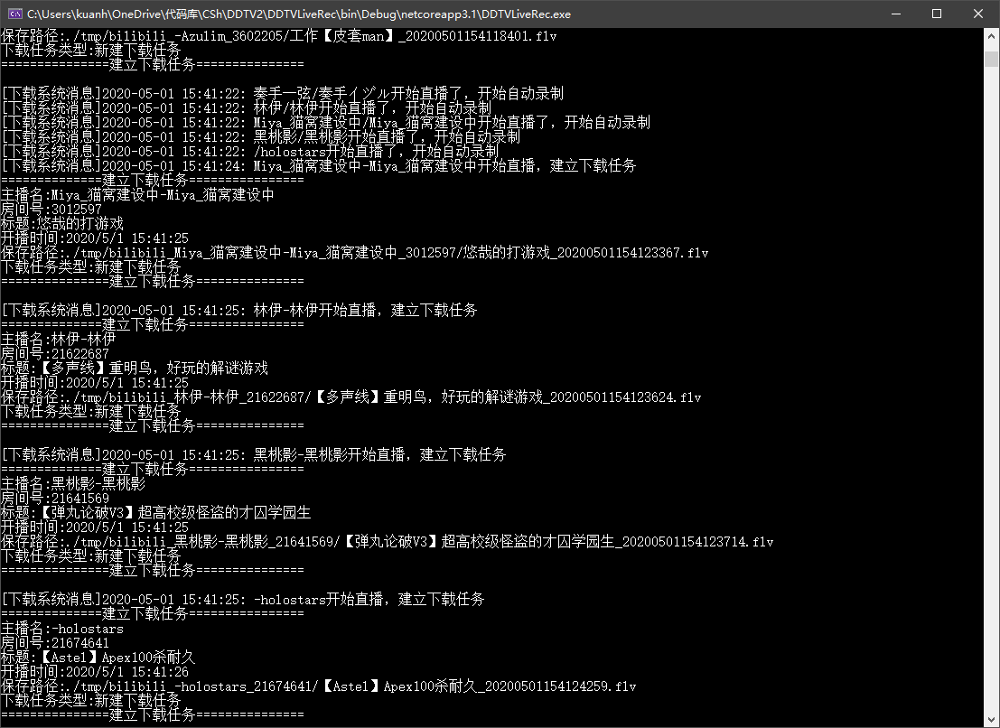
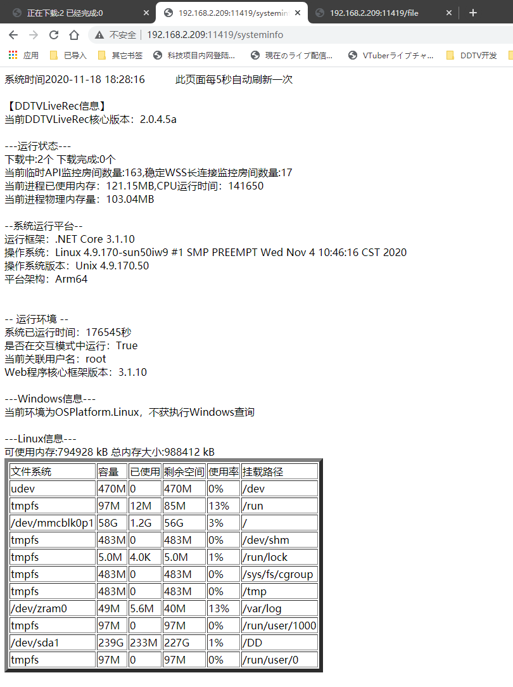
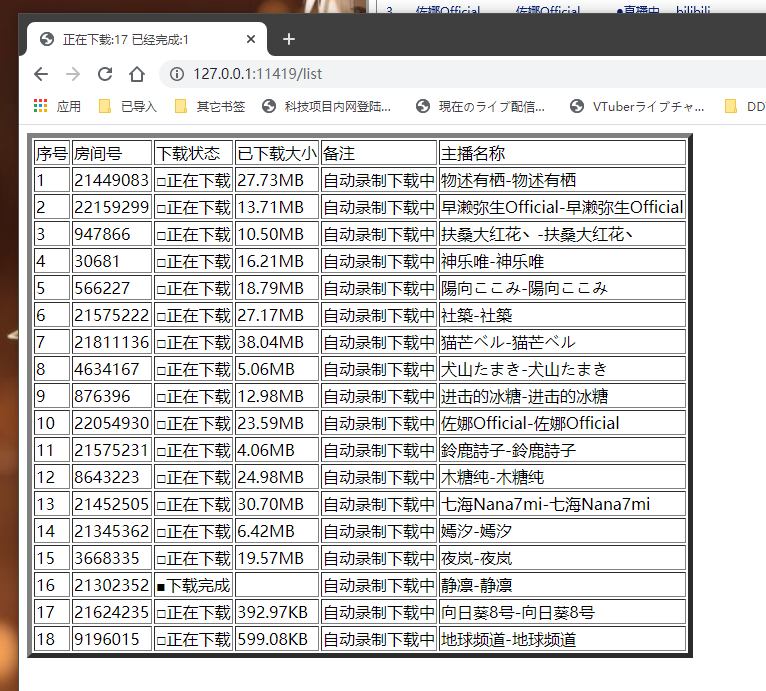
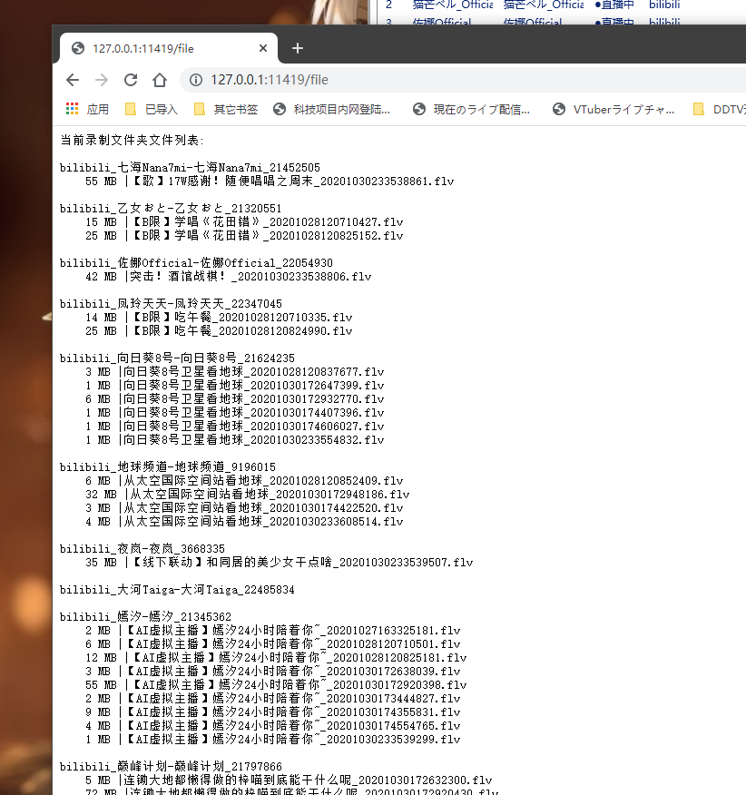

# DDTVLiveRec

一个低消耗的windows/linux/MacOS全平台通用的B站直播录制工具

***
(代码中大量 **中文** 变量\函数 **易#** 警告，美术生出身，请各位大佬轻拍 
***
 

# 安装\配置\功能说明以及常见问题
## 请先查看[DDTV官网](https://ddtv.pro/)

 
 

# 运行界面
主界面   
    

系统概况预览  
   

WEB下载状况查看界面   

WEB文件列表界面   
   

# 关于监控列表
兼容DDTVLiveRec，DDTV1.0，DDTV2.0通用。    

### 在更新软件的时候请备份好RoomListConfig.json文件，该文件是监控房间配置文件
### 在更新软件的时候请备份好RoomListConfig.json文件，该文件是监控房间配置文件
### 在更新软件的时候请备份好RoomListConfig.json文件，该文件是监控房间配置文件
 

# 使用到的第三方组件
* [BiliAccount](https://github.com/LeoChen98/BiliAccount)
* [FFmpeg](https://github.com/FFmpeg/FFmpeg)
* [vtbs.moe](https://github.com/dd-center/vtbs.moe)
