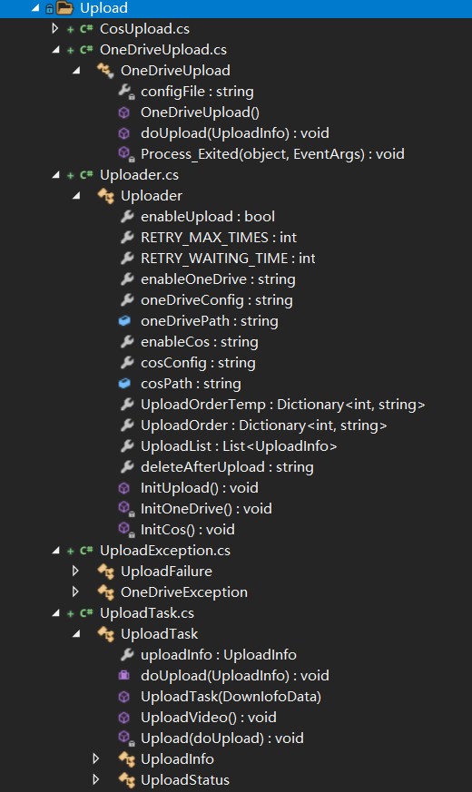
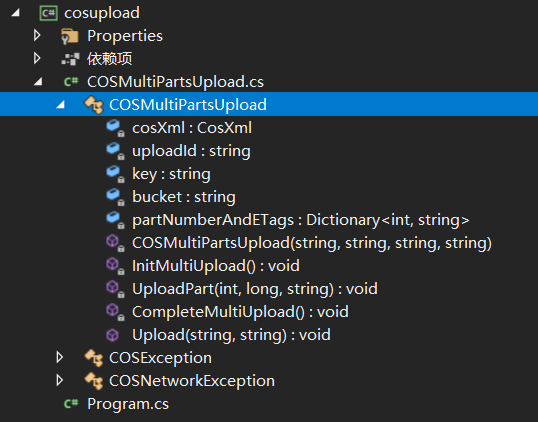
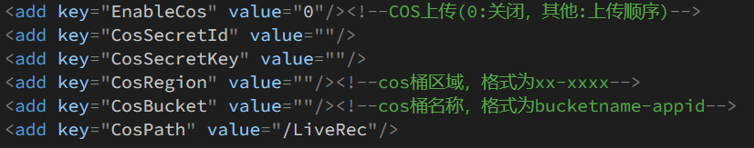
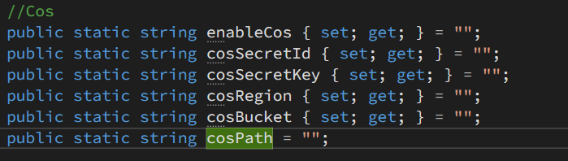
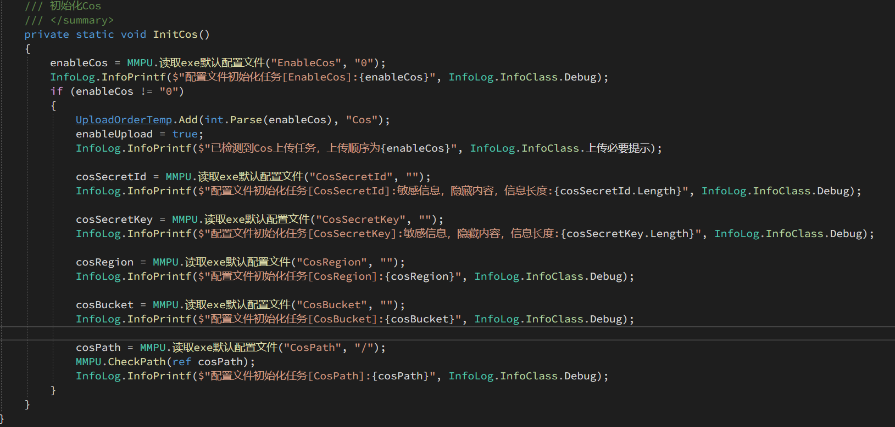
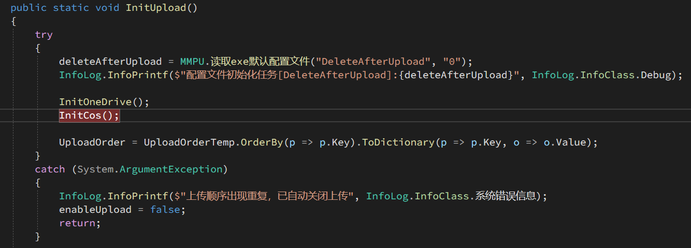
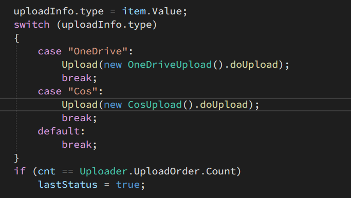

## 新增上传配置(以Cos为例)
### 0 代码结构介绍
  
在Auxiliary项目下，有Upload的文件夹  
- xxxUpload.cs 不同上传目标的实现上传的代码
- Uploader.cs 静态类，用于初始化并保存上传配置、管理上传顺序
- UploadException.cs 自定义异常类，用于上传失败时的异常处理
- UplaodTask.cs 上传任务，每次上传实例化此类，其中包括上传信息以及上传状态等内容  

### 1 配置好基本上传代码
1. 使用c#写出能正常运行的上传代码，需要有一个public函数进行上传  
     
2. 统计所需的配置属性  
    > - string:secretId 访问腾讯COS
    > - string:secretKey 访问腾讯COS
    > - string:region COS区域
    > - string:bucket 存储通名称
    > - string:cosPath 上传到cos的路径
### 2 修改项目内上传代码
1. 在**DDTVLiveRec**的**App.config**中新增所需的配置信息  
    EnableCOS COS上传的顺序以及开关  
    其他配置信息  用于正常上传  
      
2. 在**Uploader.cs**中新增变量用于保存配置  
   注：path变量因要使用ref引用的函数进行路径检查 不能用set get封装。  
     
3. 初始化变量  
   编写自己的初始化函数并在$InitUpload$函数中调用  
   - 初始化函数  
     
   可在app.config中开启debugcmd模式进行验证  
   - 调用初始化函数
     
4. 新增自定义上传类  
   在Upload下新建xxxUplaod.cs，将自己所写的代码复制进此文件  
   - 新增构造函数，用于初始化上传
   - 新增上传函数，需传入一个UploadTask.UploadInfo变量  
   修改源文件路径，替换成uploadInfo.srcFile  
   修改上传路径，需要将配置文件中的xxxPath和传入的uploadInfo.remotePath相结合，构成最终的上传路径。并根据实际情况选择是否在路径末尾添加文件名uploadInfo.fileName。  
   - 配置上传提示  
   (1) 控制台/log输出  
    ```csharp
        InfoLog.InfoPrintf($"Cos: {content}", InfoLog.InfoClass.上传必要提示);
        InfoLog.InfoPrintf($"Cos: {content}", InfoLog.InfoClass.系统错误信息);
    ```
   (2) Web端上传详情的“备注”栏更新  
    ```csharp
    uploadInfo.status["Cos"].comments=content;
    ```
    - 配置异常处理  
    当上传失败后，请抛出$UploadFailure$异常，便于上层捕捉后重试
5. 调用上传函数  
   在UploadTask中的switch语句中新增相应case并使用Upload函数调用自己写的上传函数
      
### 3 编译后调试检查

### 4 修改ReadME.md，编写相关使用文档