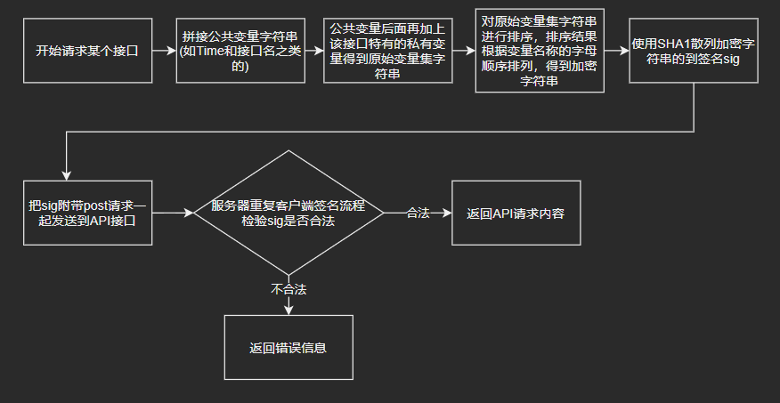

# DDTVCore API Doc

注:**该文档中所使用的ApiToken字符串为"1145141919810A"**

## 请求流程
### 流程图如下:

### 例:/api/room_delete接口
>- Request:
>```text
>method: POST
>path: http://127.0.0.1:11419/api/room_delete
>```
>```json
>"form-data":
>{
>    "time":2345678,
>    "cmd":"room_delete",
>    "sig":"2B96810325EB0FE263A91FAA71592033377DF543",
>    "ver":2,
>    "RoomId":21706862
>}
>```
>- Response:
>```json
>{
>    "result": true,
>    "messge": "成功",
>    "queue": 1,
>    "Package": [
>        {
>            "result": true,
>            "messge": "删除完成"
>        }
>    ]
>}
>```
>其中计算sig所使用的加密字符串是：  
把所有请求参数拼接，并且加上token值过后，对key进行排序后拼接得到加密字符串  
【cmd=room_delete&RoomId=21706862&time=2345678&token=1145141919810A&ver=2】  
对该字符串进行SHA1加密全部转换成大写字母后便得到sig值  
2B96810325EB0FE263A91FAA71592033377DF543  

## 注意事项:
>加密字符串拼接时公共变量sig不参与  
在拼接加密字符串时应加上变量token，但应当注意，token不应当随请求一起提交，仅在本地参与  
加密字符串拼接，键值对之间用&分割(如："code=system_info&time=1234567")  
加密中编码以UTF-8为准  
加密得到的sig在发送时转换成大写  

## 公共变量

|参数名|格式|是否必须|解释|
|:--:|:--:|:--:|--|
|time|int|是|请求发出时的UTC时间戳，单位为秒，和服务器时间300秒以内的为有效请求(如:1626508097)|
|cmd|string|是|请求的API接口的接口名称(如:system_info)|
|sig|string|是|其他变量排序后按照规则拼接过后使用SHA1散列后得到的签名|
|ver|int|是|接口的版本类型，当前只开放2。(1为DDTV服务端内部使用的WEB接口，规则不同)|


## 已实现的API列表
|方式|名称|解释|私有变量数量|
|:--:|:--:|:--:|:--:|
|POST|system_info|[获取系统运行情况](./API示例.md#post-apisystem_info)|0|
|POST|system_config|[查看当前配置文件](./API示例.md#post-apisystem_config)|0|
|POST|system_update|[检查更新](./API示例.md#post-update)|0|
|POST|rec_processing_list|[获取当前录制中的队列简报](./API示例.md#post-apirec_processing_list)|0|
|POST|rec_all_list|[获取所有下载任务的队列简报](./API示例.md#post-apirec_all_list)|0|
|POST|rec_info|[根据录制任务GUID获取任务详情](./API示例.md#post-apirec_info)|1|
|POST|rec_cancel|[根据录制任务GUID取消相应任务](./API示例.md#post-apirec_cancel)|2|
|POST|room_add|[增加配置文件中监听的房间](./API示例.md#post-apiroom_add)|4|
|POST|room_delete|[删除配置文件中监听的房间](./API示例.md#post-apiroom_delete)|1|
|POST|room_status|[修改房间的自动录制开关配置](./API示例.md#post-apiroom_status)|2|
|POST|room_list|[获取当前房间配置列表总览](./API示例.md#post-apiroom_list)|0|
|POST|file_lists|[获取当前录制文件夹中的所有文件的列表](./API示例.md#post-apifile_lists)|0|
|POST|file_delete|[删除某个录制完成的文件](./API示例.md#post-apifile_delete)|3|
|POST|file_range|[根据房间号获得相关录制文件](./API示例.md#post-apifile_range)|1|


- 私有变量  

|参数名|格式|是否必须|解释|
|:--:|:--:|:--:|--|
|time|int|是|请求发出时的UTC时间戳，单位为秒，和服务器时间300秒以内的为有效请求(如:1626508097)|
|cmd|string|是|请求的API接口的接口名称(如:system_info)|
|sig|string|是|其他变量排序后按照规则拼接过后使用SHA1散列后得到的签名|

## `POST /api/system_info`
## 获取系统运行情况

- 私有变量  

无

- Request:
```text
method: POST
path: http://127.0.0.1:11419/api/system_info
```
```json
"form-data":
{
    "time":2345678,
    "cmd":"system_info",
    "sig":"xxxxxxxxxxxxxxxxxxxxxxxxxxxxxx",
    "var":2
}
```
- Response:
```json
{
    "result": true,
    "messge": "成功",
    "queue": 1,
    "Package": [
        {
            "DDTVCore_Ver": "2.0.5.1d",
            "Room_Quantity": 1,
            "OS_Info": {
                "OS_Ver": "Linux 5.4.0-74-generic #83-Ubuntu SMP Sat May 8 02:35:39 UTC 2021",
                "OS_Tpye": "X64",
                "Memory_Usage": 155086848,
                "Runtime_Ver": "X64",
                "UserInteractive": true,
                "Associated_Users": "ddtv",
                "Current_Directory": "\\home\\ubuntu\\ddtv_S",
                "AppCore_Ver": ".NET 5.0.8",
                "WebCore_Ver": "5.0.8"
            },
            "Download_Info": {
                "Downloading": 0,
                "Completed_Downloads": 1
            },
            "Ver_Info": {
                "IsNewVer": false,
                "NewVer":null,
                "Update_Log": null
            }
        }
    ]
}
```

## `POST /api/system_config`
## 查看当前配置文件
- 私有变量  

无
- Request:
```text
method: POST
path: http://127.0.0.1:11419/api/system_config
```
```json
"form-data":
{
    "time":2345678,
    "cmd":"system_config",
    "sig":"xxxxxxxxxxxxxxxxxxxxxxxxxxxxxx",
    "var":2
}
```
- Response:
```json
{
    "result": true,
    "messge": "成功",
    "queue": 60,
    "Package": [
        {
            "Key": "file",
            "Value": "./tmp/"
        },
        {
            "Key": "Livefile",
            "Value": "./tmp/LiveCache/"
        },
        {
            "Key": "DANMU",
            "Value": "1"
        },
        {
            "Key": "PlayWindowHeight",
            "Value": "440"
        },
        {
            "Key": "PlayWindowWidth",
            "Value": "720"
        },
        {
            "Key": "YouTubeResolution",
            "Value": "640x360"
        },
        {
            "Key": "RoomConfiguration",
            "Value": "./RoomListConfig.json"
        },
        .....................
    ]
}
```


## `POST /api/update`
## 检查有无更新
- 私有变量  

无
- Request:
```text
method: POST
path: http://127.0.0.1:11419/api/update
```
```json
"form-data":
{
    "time":2345678,
    "cmd":"update",
    "sig":"xxxxxxxxxxxxxxxxxxxxxxxxxxxxxx",
    "var":2
}
```
- Response:
```json
{
    "result": true,
    "messge": "成功",
    "queue": 1,
    "Package": [
       {
           "IsNewVer":false,
           "NewVer":null,
           "Update_Log":null
       }
    ]
}
```


## `POST /api/rec_processing_list`
## 获取当前录制中的队列简报
- 私有变量  

无
- Request:
```text
method: POST
path: http://127.0.0.1:11419/api/rec_processing_list
```
```json
"form-data":
{
    "time":2345678,
    "cmd":"rec_processing_list",
    "sig":"xxxxxxxxxxxxxxxxxxxxxxxxxxxxxx",
    "var":2
}
```
- Response:
```json
{
    "result": true,
    "messge": "成功",
    "queue": 1,
    "Package": [
        {
            "RoomId": "21706862",
            "Downloaded_bit": 1346472247,
            "Downloaded_str": "1.254G",
            "Name": "七咔拉CHikalar",
            "StartTime": 1626783169,
            "EndTime": 0,
            "GUID": "fb7f502e-64ff-411b-9d55-d9f974751616"
        }
    ]
}
```

## `POST /api/rec_all_list`
## 获取所有下载任务的队列简报
- 私有变量  

无
- Request:
```text
method: POST
path: http://127.0.0.1:11419/api/rec_all_list
```
```json
"form-data":
{
    "time":2345678,
    "cmd":"rec_all_list",
    "sig":"xxxxxxxxxxxxxxxxxxxxxxxxxxxxxx",
    "var":2
}
```
- Response:
```json
{
    "result": true,
    "messge": "成功",
    "queue": 1,
    "Package": [
        {
            "RoomId": "21706862",
            "Downloaded_bit": 1346472247,
            "Downloaded_str": "1.254G",
            "Name": "七咔拉CHikalar",
            "StartTime": 1626783169,
            "EndTime": 0,
            "GUID": "fb7f502e-64ff-411b-9d55-d9f974751616"
        }
    ]
}
```


## `POST /api/rec_info`
## 根据录制任务GUID获取任务详情
- 私有变量  

|参数名|格式|是否必须|解释|
|:--:|:--:|:--:|--|
|GUID|string|是|任务的GUID值，可通过rec_processing_list和rec_all_list接口获得|

- Request:
```text
method: POST
path: http://127.0.0.1:11419/api/rec_info
```
```json
"form-data":
{
    "time":2345678,
    "cmd":"rec_info",
    "sig":"xxxxxxxxxxxxxxxxxxxxxxxxxxxxxx",
    "var":2,
    "GUID":"a38c4f1c-18a8-454c-ad22-dc1deb612c12"
}
```
- Response:
```json
{
    "result": true,
    "messge": "成功",
    "queue": 1,
    "Package": [
        {
            "阿B直播流对象": {
                "m_innerRts": null,
                "startIn": false,
                "wss_S": ""
            },
            "弹幕储存流": null,
            "礼物储存流": null,
            "弹幕录制基准时间": "2021-07-20T11:47:45.5530392+08:00",
            "WC": null,
            "下载状态": true,
            "最后连接时间": 1626781716,
            "网络超时": false,
            "已下载大小bit": 39291289.0,
            "已下载大小str": "37.47MB",
            "文件保存路径": "./tmp/bilibili_七咔拉CHikalar_21706862/【早安还债】土豆子还债中_20210720114745552.flv",
            "事件GUID": "a38c4f1c-18a8-454c-ad22-dc1deb612c12",
            "备注": "自动录制",
            "开始时间": 1626781671,
            "结束时间": 0,
            "房间_频道号": "21706862",
            "平台": "bilibili",
            "是否保存": true,
            "下载地址": "https://d1--cn-gotcha04.bilivideo.com/live-bvc/969914/live_484660274_78967043.flv?cdn=cn-gotcha04&expires=1626756463&len=0&oi=605583931&pt=web&qn=10000&trid=1000319df535301044089db508e00ea733ba&sigparams=cdn,expires,len,oi,pt,qn,trid&sign=e3dc89e76b8d8ff58db1fee4c7abd83a&ptype=0&src=9&sl=2&sk=417e709c171a500&order=1",
            "标题": "【早安还债】土豆子还债中",
            "播放状态": false,
            "是否是播放任务": false,
            "重连文件路径": null,
            "主播名称": "七咔拉CHikalar",
            "继承": {
                "是否为继承对象": false,
                "待合并文件列表": [],
                "继承的下载文件路径": null,
                "合并后的文件路径": null
            },
            "是否是固定视频": false
        }
    ]
}
```

## `POST /api/rec_cancel`
## 根据录制任务GUID取消相应任务
- 私有变量  

|参数名|格式|是否必须|解释|
|:--:|:--:|:--:|--|
|GUID|string|是|任务的GUID值，可通过rec_processing_list和rec_all_list接口获得|
|RoomId|int|是|该任务所属的房间号|

- Request:
```text
method: POST
path: http://127.0.0.1:11419/api/rec_cancel
```
```json
"form-data":
{
    "time":2345678,
    "cmd":"rec_cancel",
    "sig":"xxxxxxxxxxxxxxxxxxxxxxxxxxxxxx",
    "var":2,
    "GUID":"fb7f502e-64ff-411b-9d55-d9f974751616",
    "RoomId":21706862
}
```
- Response:
```json
{
    "result": true,
    "messge": "删除成功",
    "queue": 1,
    "Package": [
        {
            "阿B直播流对象": {
                "m_innerRts": null,
                "startIn": false,
                "wss_S": ""
            },
            "弹幕储存流": null,
            "礼物储存流": null,
            "弹幕录制基准时间": "2021-07-20T12:12:48.9372528+08:00",
            "WC": null,
            "下载状态": false,
            "最后连接时间": 1626783195,
            "网络超时": false,
            "已下载大小bit": 8644969.0,
            "已下载大小str": "8.24MB",
            "文件保存路径": "./tmp/bilibili_七咔拉CHikalar_21706862/【早安还债】土豆子还债中_20210720121248923.flv",
            "事件GUID": "fb7f502e-64ff-411b-9d55-d9f974751616",
            "备注": "用户取消下载",
            "开始时间": 1626783175,
            "结束时间": 1626783195,
            "房间_频道号": "21706862",
            "平台": "bilibili",
            "是否保存": true,
            "下载地址": "https://d1--cn-gotcha04.bilivideo.com/live-bvc/479757/live_484660274_78967043.flv?cdn=cn-gotcha04&expires=1626757967&len=0&oi=605583931&pt=web&qn=10000&trid=1000b282f342323a46f7929767548ec2afa4&sigparams=cdn,expires,len,oi,pt,qn,trid&sign=955cc6c61a565b456c747880e031f33c&ptype=0&src=9&sl=2&sk=417e709c171a500&order=1",
            "标题": "【早安还债】土豆子还债中",
            "播放状态": false,
            "是否是播放任务": false,
            "重连文件路径": null,
            "主播名称": "七咔拉CHikalar",
            "继承": {
                "是否为继承对象": false,
                "待合并文件列表": [],
                "继承的下载文件路径": null,
                "合并后的文件路径": null
            },
            "是否是固定视频": false
        }
    ]
}
```

## `POST /api/room_add`
## 增加配置文件中监听的房间
- 私有变量  

|参数名|格式|是否必须|解释|
|:--:|:--:|:--:|--|
|RoomId|int|是|房间号|
|Name|string|是|本地化(翻译)的名字|
|OfficialName|string|是|官方原文名称|
|RecStatus|bool|是|是否打开开播自动录制|

- Request:
```text
method: POST
path: http://127.0.0.1:11419/api/room_add
```
```json
"form-data":
{
    "time":2345678,
    "cmd":"room_add",
    "sig":"xxxxxxxxxxxxxxxxxxxxxxxxxxxxxx",
    "var":2,
    "RoomId":21706862,
    "Name":"七咔拉CHikalar",
    "OfficialName":"七咔拉CHikalar",
    "RecStatus":true,
}
```
- Response:
```json
{
    "result": true,
    "messge": "成功",
    "queue": 1,
    "Package": [
        {
            "result": true,
            "messge": "七咔拉CHikalar[21706862]添加完成"
        }
    ]
}
```


## `POST /api/room_delete`
## 删除配置文件中监听的房间
- 私有变量  

|参数名|格式|是否必须|解释|
|:--:|:--:|:--:|--|
|RoomId|int|是|配置文件中的房间号|
- Request:
```text
method: POST
path: http://127.0.0.1:11419/api/room_delete
```
```json
"form-data":
{
    "time":2345678,
    "cmd":"room_delete",
    "sig":"xxxxxxxxxxxxxxxxxxxxxxxxxxxxxx",
    "var":2,
    "RoomId":21706862
}
```
- Response:
```json
{
    "result": true,
    "messge": "成功",
    "queue": 1,
    "Package": [
        {
            "result": true,
            "messge": "删除完成"
        }
    ]
}
```


## `POST /api/room_status`
## 修改房间的自动录制开关配置
- 私有变量  

|参数名|格式|是否必须|解释|
|:--:|:--:|:--:|--|
|RoomId|int|是|房间号|
|RecStatus|bool|是|是否打开开播自动录制|
- Request:
```text
method: POST
path: http://127.0.0.1:11419/api/room_status
```
```json
"form-data":
{
    "time":2345678,
    "cmd":"room_status",
    "sig":"xxxxxxxxxxxxxxxxxxxxxxxxxxxxxx",
    "var":2,
    "RoomId":21706862,
    "RecStatus":false
}
```
- Response:
```json
{
    "result": true,
    "messge": "成功",
    "queue": 1,
    "Package": [
        {
            "result": true,
            "messge": "修改设置完成"
        }
    ]
}
```

## `POST /api/room_list`
## 获取当前房间配置列表总览
- 私有变量  

无  

- Request:
```text
method: POST
path: http://127.0.0.1:11419/api/room_list
```
```json
"form-data":
{
    "time":2345678,
    "cmd":"room_list",
    "sig":"xxxxxxxxxxxxxxxxxxxxxxxxxxxxxx",
    "var":2,
}
```
- Response:
```json
{
    "result": true,
    "messge": "成功",
    "queue": 1,
    "Package": [
        {
            "名称": "七咔拉CHikalar",
            "原名": "七咔拉CHikalar",
            "直播状态": false,
            "平台": "bilibili",
            "是否提醒": false,
            "是否录制": false,
            "唯一码": "21706862"
        }
    ]
}
```


## `POST /api/file_lists`
## 获取当前录制文件夹中的所有文件的列表
- 私有变量  

无  

- Request:
```text
method: POST
path: http://127.0.0.1:11419/api/file_lists
```
```json
"form-data":
{
    "time":2345678,
    "cmd":"file_lists",
    "sig":"xxxxxxxxxxxxxxxxxxxxxxxxxxxxxx",
    "var":2,
}
```
- Response:
```json
{
    "result": true,
    "messge": "成功",
    "queue": 3,
    "Package": [
        {
            "Size": 151728128,
            "Name": "【早安还债】土豆子还债中_20210720111734878.flv",
            "Directory": "bilibili_七咔拉CHikalar_21706862",
            "Path": "./tmp/bilibili_七咔拉CHikalar_21706862/【早安还债】土豆子还债中_20210720111734878.flv",
            "ModifiedTime": "2021-07-20T11:17:40.0501024+08:00"
        },
        {
            "Size": 13717504,
            "Name": "【早安还债】土豆子还债中_20210720112241897.flv",
            "Directory": "bilibili_七咔拉CHikalar_21706862",
            "Path": "./tmp/bilibili_七咔拉CHikalar_21706862/【早安还债】土豆子还债中_20210720112241897.flv",
            "ModifiedTime": "2021-07-20T11:22:47.150608+08:00"
        },
        {
            "Size": 6270976,
            "Name": "【早安还债】土豆子还债中_20210720112652317.flv",
            "Directory": "bilibili_七咔拉CHikalar_21706862",
            "Path": "./tmp/bilibili_七咔拉CHikalar_21706862/【早安还债】土豆子还债中_20210720112652317.flv",
            "ModifiedTime": "2021-07-20T11:26:57.770125+08:00"
        }
    ]
}
```


## `POST /api/file_delete`
## 删除某个录制完成的文件
- 私有变量  

|参数名|格式|是否必须|解释|
|:--:|:--:|:--:|--|
|RoomId|int|是|配置文件中的房间号|
|Directory|string|是|所在的文件夹名称|
|Name|string|是|要删除的文件名|
- Request:
```text
method: POST
path: http://127.0.0.1:11419/api/file_delete
```
```json
"form-data":
{
    "time":2345678,
    "cmd":"file_delete",
    "sig":"xxxxxxxxxxxxxxxxxxxxxxxxxxxxxx",
    "var":2,
    "RoomId":"21706862",
    "Directory":"bilibili_七咔拉CHikalar_21706862",
    "Name":"【早安还债】土豆子还债中_20210720112652317.flv",
}
```
- Response:
```json
{
    "result": true,
    "messge": "成功",
    "queue": 1,
    "Package": [
        {
            "result": true,
            "messge": "文件已提加入删除委托列表，等待文件锁解锁后自动删除"
        }
    ]
}
```


## `POST /api/file_range`
## 根据房间号获得相关录制文件
- 私有变量  

|参数名|格式|是否必须|解释|
|:--:|:--:|:--:|--|
|RoomId|int|是|房间号|

- Request:
```text
method: POST
path: http://127.0.0.1:11419/api/file_range
```
```json
"form-data":
{
    "time":2345678,
    "cmd":"file_range",
    "sig":"xxxxxxxxxxxxxxxxxxxxxxxxxxxxxx",
    "var":2,
    "RoomId":"21706862"
}
```
- Response:
```json
{
    "result": true,
    "messge": "成功",
    "queue": 3,
    "Package": [
        {
            "Size": 151728128,
            "Name": "【早安还债】土豆子还债中_20210720111734878.flv",
            "Directory": "bilibili_七咔拉CHikalar_21706862",
            "Path": "./tmp/bilibili_七咔拉CHikalar_21706862/【早安还债】土豆子还债中_20210720111734878.flv",
            "ModifiedTime": "2021-07-20T11:17:40.0501024+08:00"
        },
        {
            "Size": 13717504,
            "Name": "【早安还债】土豆子还债中_20210720112241897.flv",
            "Directory": "bilibili_七咔拉CHikalar_21706862",
            "Path": "./tmp/bilibili_七咔拉CHikalar_21706862/【早安还债】土豆子还债中_20210720112241897.flv",
            "ModifiedTime": "2021-07-20T11:22:47.150608+08:00"
        },
        {
            "Size": 6270976,
            "Name": "【早安还债】土豆子还债中_20210720112652317.flv",
            "Directory": "bilibili_七咔拉CHikalar_21706862",
            "Path": "./tmp/bilibili_七咔拉CHikalar_21706862/【早安还债】土豆子还债中_20210720112652317.flv",
            "ModifiedTime": "2021-07-20T11:26:57.770125+08:00"
        }
    ]
}
```

