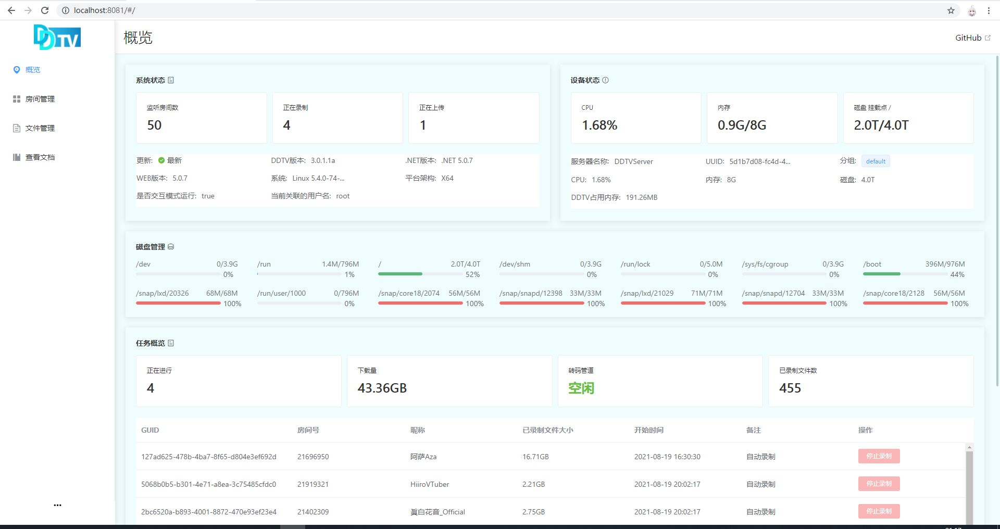
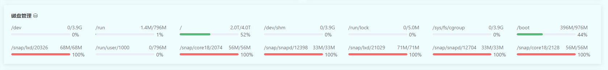
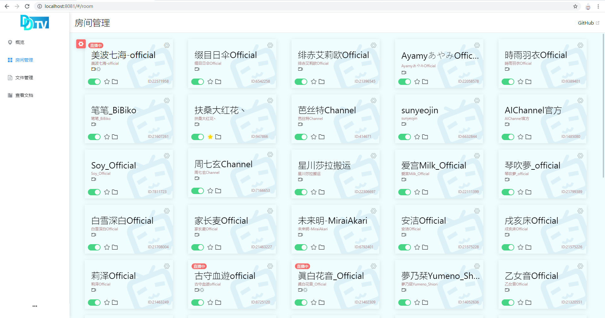

# WEB服务器
## 一、项目介绍

### 1、介绍
本项目使用 辽ddtv 的webapi 开发了一套与之相匹配的在线管理页面。

### 2、基本功能
查看系统当前状况；查看正在录制的任务并能结束；添加、删除房间；开启、关闭自动录制；删除文件；查看目前的文件；在线播放。

TODO:上传状态查看、日志分析、细化文件管理、重构播放页面
### 3、环境
本项目基于**纯天然、植物饲养的**Vue 2.0
### 4、配置
您需要打开 public 下的 static 文件夹，找到config.js
如果您使用的是编译好的包 请您在 static 文件夹，找到config.js 即可
```js
window.apiObj = {
    // 如果您是前后端部署在一起，本配置填写 false 即可
    // 如果您是前端后端分离 这里配置你的后端地址
    // 如 http(s)://you.host:port (最后面不需要 / )
    apiUrl: false,
    // 这里是用来配置主要展示的挂载磁盘，仅Linux系统配置有效。
    // 默认展示的是 / 下挂载的磁盘，您可根据自身情况更改
    mount:'/'
  }
```
> **注意：** 更改 config.js 或者手动更新前端页面**无需重启服务**，您**仅需清除浏览器缓存的数据即可**，如果您更改配置后发现其仍未生效，同理，也仅需清除浏览器缓存即可。
# 二、使用
## 1、叨一叨
其实这个项目算我不务正业做的第一个基于**纯天然、植物饲养的**Vue 2.0web项目。
给我幼小的心灵留下了不可磨灭的印象，从而庆幸报专业的时候没有去变成一个前端人。
还在不断挖坑中 **目前房间设置已经基本完成** **概览页面也基本差不多了** 目前接下来的工作是：
* 把文件管理页面做的和百度云一样
* 确实应该想办法做一个显示正在上传任务的卡片了
* 移动端也是端
* 日志分析
* 配置ddtv

## 2、千里之行，始于登录
这毕竟是个`后台管理页面`你总不能敞开大门谁来都行吧，所以必须要登录。
如果你不登录看到的第一个页面就是这样：


### 2.1、账号密码登录
输入你的账号密码，通过验证了就会自己跳转。

> 什么？你说你不知道你的账号密码？去看文档

### 2.2、TOKEN 用户登录

有时候您可以会有使用服务器设定的token直接进行业务交互的需求，WebUI为您提供了使用现有token直接进行登录的开放能力。
> **注意：** 这里说的token并非您使用账号密码登陆后下发的临时token，而是服务器内设定的api token **请勿随意泄露你的API token，这样可能给你带来无法估量的后果**


## 3、WebUI的初体验
如果你成功的登录之后，你会到我们的`概览`页面，除此之外，WebUI还有很多其他的功能页面，本节会一一道来。

### 3.1、概览
`概览`页面是**用户登录进来看到的第一个页面**，它旨在告诉用户当前DDTV是什么情况，在干什么，运行它的计算机情况如何。以方便用户可以快速的对DDTV当前的状态进行评估，以便于进行下一步的处置。

概览页面分为若干个模块，分别给用户展示了`系统信息`、`设备信息`、`磁盘信息(linux限定)`、`任务概况`、`上传`

> 磁盘信息只有DDTV部署到linux操作系统中才会有。
#### 3.1.1、系统信息
系统信息旨在告知用户当前DDTV的版本、操作系统等信息。其内容与下图一致：


#### 3.1.2、设备状态
系统信息旨在让用户快速评估设备的工作状态，和让用户可以知道这是哪台服务器，这在用户有多台服务器时非常受用。


**注意：** 如果您部署在`linux`设备，磁盘信息展示的是挂载在 `/` 目录下分区的磁盘剩余容量，请您结合下面的 `磁盘信息` 栏目的内容进行判别 

本栏目中的 `服务器名称`、`UUID`、`分组` 用户均可在配置文件中自行设置

#### 3.1.3、磁盘管理
> **注意：** 磁盘管理 面板只有您部署设备运行`linux`操作系统时才可见

展示了设备所有挂载点的使用情况。


#### 3.1.4、任务概览
本面板统计了自本次运行以来正在运行的任务，与各模块的工作状态。

下面附带一个正在录制任务的表格，用户可以`停止录制`去终止录制。

#### 3.1.5、上传 TODO
> **注意：** 此功能还在开发中

本面板展示了正在上传的对象和其状态


### 3.2、房间管理
`房间管理`页面是让用户可以在快速的了解到当前ddtv房间的情况，同时可以对其配置进行修改


#### 3.2.1 小红点工具栏
> **注意：** 此功能还在开发中

`小红点工具栏`可以让您快速的使用工具对房间进行管理，它通常位于页面左上角。为一个**带有齿轮图标的淡红色圆角矩形**，当您鼠标悬浮在上面或去点击它时，他会展开，露出两个按钮个按钮或开关。


如上图右所示 带有放大镜的按钮为`搜索`、带有加号图标的按钮为`添加房间`、而最右侧的开关为`开启/关闭所有房间自动录制`
